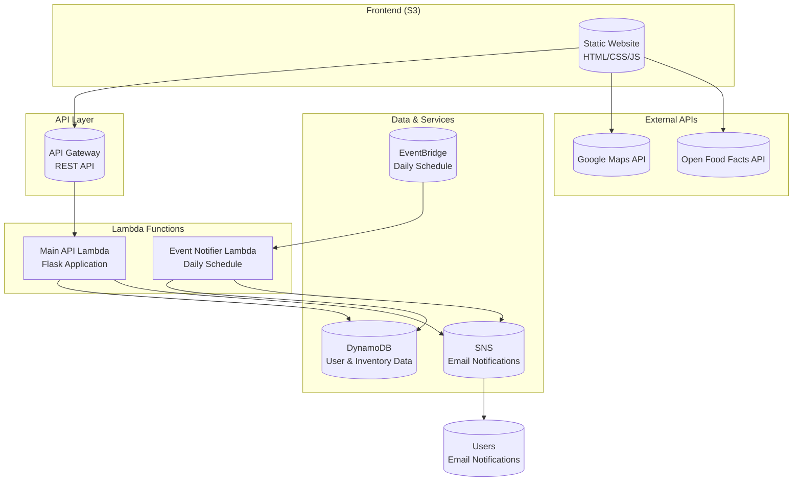

# 🍎 Food Waste Management - AWS Lambda Hackathon Project

## 🎯 **Project Overview**

**Food Waste Management** is a serverless application that helps users reduce food waste by managing their inventory, tracking expiration dates, and connecting them with local food banks. Built entirely on AWS Lambda with a focus on sustainability and community impact.

## 🏆 **Hackathon Submission**

This project was built for the AWS Lambda Hackathon, demonstrating real-world business problem solving through serverless architecture.

---

## 🚀 **How AWS Lambda Powers This Application**

### **Core Lambda Functions**

#### **1. Main API Lambda (Flask Application)**
- **Trigger**: API Gateway
- **Purpose**: Handles all CRUD operations and authentication
- **Key Features**:
  - User registration and authentication with JWT
  - Food item management (add, view, update, delete)
  - Real-time analytics and waste tracking
  - Input validation and security

```python
# Lambda function handles these endpoints:
POST /register    # User registration
POST /login       # User authentication  
GET /items        # Retrieve inventory
POST /items       # Add new items
PUT /items/{id}   # Update items
DELETE /items/{id} # Delete items
GET /analytics    # Get waste statistics
```

#### **2. Event Notifier Lambda**
- **Trigger**: EventBridge (Daily Schedule)
- **Purpose**: Automated expiration notifications
- **Schedule**: Runs daily at 12:00 PM UTC
- **Function**: Scans DynamoDB for expiring items and sends email alerts

```python
# Daily automated process:
1. Scan DynamoDB for items expiring in 3 days
2. Generate personalized email notifications
3. Send via SNS to subscribed users
4. Track notification delivery
```

### **Lambda Triggers Implementation**

#### **API Gateway Integration**
```yaml
# API Gateway triggers Lambda for:
- HTTP requests from frontend
- RESTful API endpoints
- CORS handling
- Request/response transformation
```

#### **EventBridge Integration**
```yaml
# EventBridge Rule:
- Schedule: cron(0 12 * * ? *)  # Daily at 12 PM UTC
- Target: event-notifier Lambda
- Purpose: Automated notification system
```

---

## 🛠 **AWS Services Used**

### **Core Services**
- **AWS Lambda** - Serverless compute for API and notifications
- **API Gateway** - REST API management and Lambda triggers
- **EventBridge** - Scheduled Lambda triggers for notifications
- **DynamoDB** - NoSQL database for user data and inventory
- **SNS** - Email notification delivery system

### **Supporting Services**
- **S3** - Static website hosting for frontend
- **IAM** - Security and permissions management
- **CloudWatch** - Logging and monitoring
- **Zappa** - Python Lambda deployment framework

---

## 🏗 **Architecture Diagram**



---

## 💡 **Business Problem Solved**

### **The Challenge**
- **40% of food in the US goes to waste** (USDA)
- **$218 billion** lost annually to food waste
- **Difficulty tracking** expiration dates and inventory
- **Lack of connection** between consumers and food banks

### **Our Solution**
1. **Smart Inventory Management** - Track food items with expiration dates
2. **Automated Notifications** - Lambda-powered alerts for expiring items
3. **Waste Analytics** - Real-time statistics and waste reduction insights
4. **Community Connection** - Map integration for food bank donations
5. **Barcode Scanning** - Easy product entry with automatic data fetching

---

## 🎯 **Key Features**

### **Serverless Architecture Benefits**
- **Auto-scaling** - Handles traffic spikes automatically
- **Cost-effective** - Pay only for actual usage
- **High availability** - 99.9% uptime with AWS infrastructure
- **Zero maintenance** - No server management required

### **Lambda-Powered Features**
- **Real-time API** - Instant response to user actions
- **Automated notifications** - Daily expiration alerts
- **Data processing** - Analytics and waste calculations
- **Security** - JWT authentication and input validation

---

## 📊 **Technical Implementation**

### **Lambda Function Details**

#### **Main API Lambda**
```python
# Runtime: Python 3.9
# Memory: 512 MB
# Timeout: 30 seconds
# Dependencies: Flask, boto3, PyJWT, bcrypt

# Key Functions:
- User authentication with JWT tokens
- CRUD operations for food inventory
- Real-time analytics calculation
- Input validation and sanitization
```

#### **Event Notifier Lambda**
```python
# Runtime: Python 3.9
# Memory: 256 MB
# Timeout: 60 seconds
# Trigger: EventBridge (daily schedule)

# Key Functions:
- DynamoDB scanning for expiring items
- SNS notification generation
- Email delivery tracking
- Error handling and logging
```

### **Data Flow**
1. **User Action** → API Gateway → Main Lambda → DynamoDB
2. **Daily Schedule** → EventBridge → Notifier Lambda → SNS → Email
3. **Real-time Analytics** → Lambda calculation → Frontend display

---

## 🚀 **Deployment & Testing**

### **Quick Start**
```bash
# Backend Deployment
cd food-waste-management-backend
pip install -r requirements.txt
zappa deploy dev

# Frontend Deployment
cd food-waste-management-frontend
aws s3 sync . s3://your-bucket-name --delete
```

### **Testing the Application**
1. **Register/Login** - Test user authentication
2. **Add Items** - Test CRUD operations
3. **Scan Barcodes** - Test product data integration
4. **View Analytics** - Test real-time statistics
5. **Check Notifications** - Test automated alerts

---

## 📈 **Impact & Results**

### **Environmental Impact**
- **Reduces food waste** through better tracking
- **Connects users** with local food banks
- **Promotes sustainability** through data insights

### **Technical Achievements**
- **100% Serverless** - No traditional servers required
- **Auto-scaling** - Handles any user load
- **Real-time processing** - Instant user feedback
- **Automated workflows** - Zero manual intervention

---

## 🎥 **Demo Video Script**

### **3-Minute Demo Structure**
1. **Introduction (30s)** - Problem statement and solution overview
2. **User Registration (30s)** - Show authentication flow
3. **Adding Items (45s)** - Demonstrate CRUD operations and barcode scanning
4. **Analytics Dashboard (30s)** - Show real-time statistics
5. **Notifications (30s)** - Explain automated Lambda triggers
6. **Architecture (15s)** - Quick overview of AWS services used

### **Key Points to Highlight**
- **AWS Lambda** as the core compute service
- **EventBridge** for scheduled notifications
- **API Gateway** for REST API management
- **DynamoDB** for data persistence
- **SNS** for email delivery

---

## 🏆 **Why This Project Stands Out**

### **Real-World Impact**
- **Solves actual problem** - Food waste is a global issue
- **Community-focused** - Connects users with food banks
- **Environmental impact** - Promotes sustainability

### **Technical Excellence**
- **Modern architecture** - Serverless-first approach
- **Scalable solution** - Handles growth automatically
- **Security-focused** - Comprehensive validation and authentication
- **User-friendly** - Intuitive interface with advanced features

### **Innovation**
- **Barcode integration** - Automatic product data fetching
- **Real-time analytics** - Live waste tracking
- **Automated workflows** - Zero manual intervention
- **Mobile-optimized** - Works on all devices

---

## 📞 **Contact & Links**

- **GitHub Repository**: [Your Repository URL]
- **Live Demo**: [Your S3 Website URL]
- **Video Demo**: [Your YouTube/Vimeo URL]

---

## 🎉 **Conclusion**

This Food Waste Management application demonstrates the power of AWS Lambda in solving real-world business problems. Through serverless architecture, automated workflows, and community-focused features, we've created a solution that not only reduces food waste but also connects communities and promotes sustainability.

**Built with ❤️ using AWS Lambda for the hackathon!** 