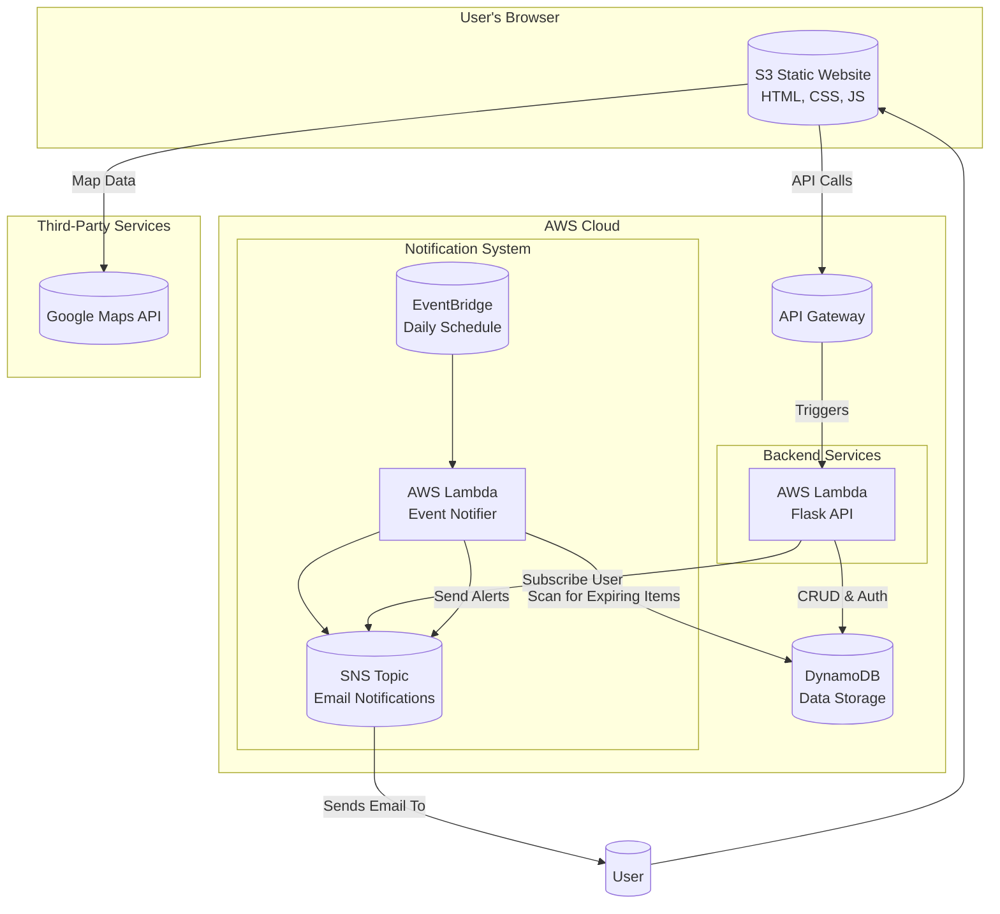

# Food Waste Management Application

This is a full-stack, serverless application designed to help users manage their food inventory, reduce waste, and find nearby food banks for donations. The application features a secure user authentication system, a dynamic food inventory dashboard, and an automated notification system for expiring items.

## Architecture Overview

The application is built on a serverless architecture using Amazon Web Services (AWS), ensuring scalability, security, and cost-efficiency.



---

## Features

- **Secure User Authentication**: Users can create an account and log in securely. Passwords are hashed with bcrypt, and sessions are managed using JSON Web Tokens (JWT).
- **Enhanced Input Validation**: Comprehensive validation for emails, passwords, and food items with sanitization to prevent injection attacks.
- **Automated Email Subscriptions**: New users are automatically subscribed to an SNS topic to receive notifications.
- **Dynamic Food Inventory**: A responsive dashboard allows users to add, view, update, and delete their food items.
- **Real-time Analytics Dashboard**: Live statistics showing total items, expiring soon, expired items, and waste percentage with visual metrics.
- **Smart Barcode Scanner**: Camera-based barcode scanning with automatic product data fetching from Open Food Facts API.
- **Product Information Integration**: Auto-fills product names, displays product images, brands, and categories when scanning barcodes.
- **Expiration Tracking**: Color-coded badges clearly indicate when food items are about to expire (green: safe, yellow: warning, red: urgent/expired).
- **Automated Expiration Alerts**: A daily scheduled Lambda function scans the inventory and sends email notifications via SNS for items nearing their expiration date.
- **Interactive Map**: Integrates with the Google Maps API to display nearby food banks based on the user's location.
- **Mobile-Optimized**: Fully responsive design that works seamlessly on desktop, tablet, and mobile devices.
- **Enhanced Error Handling**: User-friendly error messages and comprehensive validation feedback.

---

## Project Structure

```
/
├── food-waste-management-backend/
│   ├── .env                 # Stores secret keys and configuration
│   ├── app.py               # Main Flask application (authentication & CRUD API)
│   ├── event_notifier.py    # Lambda function for checking expirations
│   ├── zappa_settings.json  # Zappa deployment configuration
│   └── requirements.txt     # Python dependencies
│
└── food-waste-management-frontend/
    ├── assets/
    │   ├── css/
    │   │   ├── style.css    # Main application styles
    │   │   └── auth.css     # Authentication page styles
    │   └── js/
    │       ├── script.js    # Main dashboard functionality
    │       ├── auth.js      # Authentication logic
    │       └── barcode-scanner.js  # Barcode scanning functionality
    ├── auth.html            # Login and registration page
    ├── index.html           # Main application dashboard
    └── barcode-scanner.html # Barcode scanner page
```

---

## Deployment Guide

This guide provides the step-by-step instructions to deploy the entire application.

### **Part 1: AWS Prerequisites**

#### 1.1. Create DynamoDB Table
- **Service**: AWS DynamoDB
- **Table Name**: `food-inventory-table`
- **Primary Key**:
  - **Partition Key**: `pk` (String)
  - **Sort Key**: `sk` (String)
- This composite key structure enables a flexible single-table design pattern.

#### 1.2. Create SNS Topic
- **Service**: AWS Simple Notification Service (SNS)
- **Topic Name**: `food-expiration-notifications`
- **Type**: Standard
- After creation, **copy the Topic ARN**. You will need it for the backend configuration.

### **Part 2: Backend Deployment**

1.  **Configure Environment**:
    - Navigate to the `food-waste-management-backend` directory.
    - Create a file named `.env` and add your configuration variables. Replace the placeholder values with your actual keys and ARNs.
      ```
      SECRET_KEY='your-super-strong-and-secret-jwt-key'
      DYNAMODB_TABLE_NAME='food-inventory-table'
      AWS_REGION='us-east-1'
      SNS_TOPIC_ARN='arn:aws:sns:us-east-1:123456789012:your-sns-topic-name'
      ```
2.  **Install Dependencies**:
    ```bash
    # (Optional but recommended) Create and activate a virtual environment
    python -m venv venv
    source venv/bin/activate # On Windows: venv\Scripts\activate
    
    # Install packages
    pip install -r requirements.txt
    ```
3.  **Initialize Zappa**:
    - Run `zappa init` and follow the prompts.
4.  **Configure Zappa for IAM Permissions**:
    - Open `zappa_settings.json`.
    - Add the `iam_policy_statements` block inside your environment settings (e.g., `"dev"`). This grants the backend permissions for DynamoDB operations and SNS interaction.
      ```json
      "iam_policy_statements": [
          {
              "Effect": "Allow",
              "Action": [
                  "dynamodb:PutItem",
                  "dynamodb:GetItem",
                  "dynamodb:Query",
                  "dynamodb:DeleteItem",
                  "dynamodb:Scan"
              ],
              "Resource": "YOUR_DYNAMODB_TABLE_ARN_HERE"
          },
          {
              "Effect": "Allow",
              "Action": [
                  "sns:Subscribe",
                  "sns:Publish"
              ],
              "Resource": "YOUR_SNS_TOPIC_ARN_HERE"
          }
      ]
      ```
    - **Replace `YOUR_DYNAMODB_TABLE_ARN_HERE` and `YOUR_SNS_TOPIC_ARN_HERE`** with your actual resource ARNs.
5.  **Deploy**:
    - Run `zappa deploy dev`.
    - **Copy the API Gateway URL** that Zappa provides after deployment.

### **Part 3: Frontend Deployment**

1.  **Connect Frontend to Services**:
    - **API Gateway**: Open `assets/js/script.js` and `assets/js/auth.js`. Replace the placeholder API URL with the one you copied from Zappa.
    - **Google Maps**: Open `index.html`. Replace `YOUR_API_KEY` in the Google Maps script tag with your key from the Google Cloud Console.
2.  **Deploy to S3**:
    - In the AWS S3 console, create a new bucket.
    - **Disable "Block all public access"**.
    - Upload `index.html`, `auth.html`, and the `assets/` directory.
    - Make all uploaded files and folders **public** (Actions -> Make public using ACL).
    - In the bucket's **Properties** tab, enable **Static website hosting** and set the index document to `index.html`.
    - Use the provided **Bucket website endpoint** to access your application.

### **Part 4: Notification System Deployment**

#### 4.1. Create IAM Role for Notifier
- **Service**: AWS IAM
- **Role Name**: `EventNotifierLambdaRole`
- **Use Case**: Lambda
- **Attached Policies**:
  1.  `AWSLambdaBasicExecutionRole` (for logs)
  2.  `AmazonDynamoDBReadOnlyAccess`
  3.  `AmazonSNSFullAccess`

#### 4.2. Create Notifier Lambda Function
- **Service**: AWS Lambda
- **Function Name**: `event-notifier`
- **Runtime**: Python 3.9
- **Permissions**: Use the existing `EventNotifierLambdaRole` you created.
- **Configure Environment Variables**:
  - `DYNAMODB_TABLE_NAME`: `food-inventory-table`
  - `SNS_TOPIC_ARN`: Your SNS Topic ARN.
- **Upload Code**:
  - In your terminal, navigate to the backend directory.
  - Create a zip file of the notifier: `zip function.zip event_notifier.py`.
  - In the Lambda console's **Code** tab, upload `function.zip`.

#### 4.3. Create EventBridge Schedule
- **Service**: AWS EventBridge
- **Rule Name**: `DailyEventNotifier`
- **Pattern**: Schedule
- **Cron Expression**: `cron(0 12 * * ? *)` (runs daily at 12:00 PM UTC).
- **Target**: Select the `event-notifier` Lambda function.

---

## Environment Configuration

### Backend Environment Variables
Create a `.env` file in the `food-waste-management-backend` directory with the following variables:

```env
SECRET_KEY='your-super-strong-and-secret-jwt-key'
DYNAMODB_TABLE_NAME='food-inventory-table'
AWS_REGION='us-east-1'
SNS_TOPIC_ARN='arn:aws:sns:us-east-1:123456789012:your-sns-topic-name'
```

### Frontend Configuration
Update the following files with your actual API endpoints and keys:

1. **API Gateway URL**: Update `assets/js/script.js`, `assets/js/auth.js`, and `assets/js/barcode-scanner.js`
2. **Google Maps API Key**: Update `index.html` with your Google Maps API key

---

## Dependencies

### Backend Dependencies (`requirements.txt`)
```
Flask
boto3
werkzeug
Zappa
python-dotenv
bcrypt
PyJWT
Flask-Cors
```

### Frontend Dependencies
The frontend uses vanilla HTML, CSS, and JavaScript with external libraries:
- **Bootstrap 5.3.3** - UI framework
- **Font Awesome 6.4.0** - Icons
- **Google Maps JavaScript API** - Map functionality
- **Google Places API** - Location services
- **ZXing Library** - Barcode scanning
- **Open Food Facts API** - Product database

---

## Usage

### **Getting Started**
1. **Access the Application**: Navigate to your S3 bucket's website endpoint
2. **Register/Login**: Create an account or log in with existing credentials
3. **Dashboard Overview**: View your analytics and inventory at a glance

### **Managing Food Items**
1. **Add Items Manually**: Use the form on the dashboard to add food items
2. **Scan Barcodes**: Use the barcode scanner for quick product entry
3. **Monitor Expirations**: View color-coded expiration status on the dashboard
4. **Update Items**: Edit existing items as needed
5. **Delete Items**: Remove items from your inventory

### **Advanced Features**
1. **Analytics Dashboard**: Monitor your waste patterns and inventory statistics
2. **Barcode Scanner**: Scan product barcodes to auto-fill product information
3. **Find Food Banks**: Use the interactive map to locate nearby donation centers
4. **Receive Notifications**: Get email alerts for items nearing expiration

### **Barcode Scanner Usage**
1. **Camera Access**: Allow camera permissions when prompted
2. **Scan Products**: Point camera at product barcodes
3. **Auto-fill Data**: Product information is automatically populated
4. **Manual Entry**: Fallback option for products not in database
5. **Test Mode**: Use the "Test Product Lookup" button for testing

---

## API Endpoints

### **Authentication**
- `POST /register` - User registration with validation
- `POST /login` - User authentication with JWT token

### **Food Items**
- `GET /items` - Retrieve user's food inventory
- `POST /items` - Add new food item with validation
- `PUT /items/{item_id}` - Update existing food item
- `DELETE /items/{item_id}` - Delete food item

### **Analytics**
- `GET /analytics` - Get user's inventory statistics and waste metrics

### **Health Check**
- `GET /health` - API health status

---

## Security Considerations

- **JWT Tokens**: All authentication uses secure JWT tokens with 24-hour expiration
- **Password Hashing**: Passwords are hashed using bcrypt with salt
- **Input Validation**: Comprehensive validation for all user inputs
- **Input Sanitization**: Protection against injection attacks
- **Environment Variables**: Sensitive data is stored in environment variables
- **IAM Permissions**: Minimal required permissions for each service
- **HTTPS**: API Gateway provides HTTPS endpoints
- **CORS**: Properly configured Cross-Origin Resource Sharing

---

## Troubleshooting

### Common Issues

1. **CORS Errors**: Ensure your API Gateway has CORS enabled
2. **DynamoDB Access Denied**: Verify IAM permissions for the Lambda function
3. **SNS Notifications Not Working**: Check SNS topic ARN and Lambda permissions
4. **Google Maps Not Loading**: Verify API key and billing setup
5. **Barcode Scanner Not Working**: Check camera permissions and HTTPS requirement
6. **Product Data Not Loading**: Verify internet connection for Open Food Facts API

### Debugging Steps

1. Check CloudWatch logs for Lambda function errors
2. Verify environment variables are correctly set
3. Test API endpoints using tools like Postman
4. Check browser console for frontend errors
5. Verify camera permissions for barcode scanning
6. Test product lookup with known barcodes

### **Sample Barcodes for Testing**
- **3017620422003** - Nutella
- **5000159407236** - Snickers
- **5010477338825** - Coca Cola

---

## Contributing

1. Fork the repository
2. Create a feature branch
3. Make your changes
4. Test thoroughly
5. Submit a pull request

---

## License

This project is licensed under the MIT License - see the LICENSE file for details.

---

## Support

For issues and questions:
1. Check the troubleshooting section above
2. Review AWS CloudWatch logs
3. Create an issue in the repository